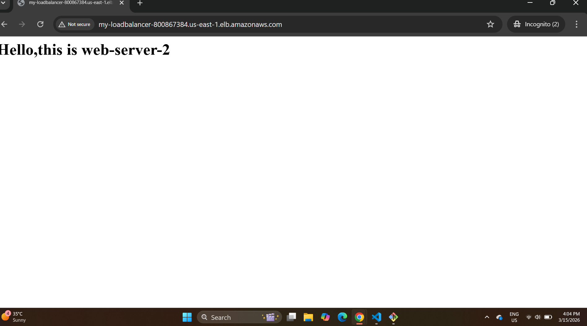

# 🚀 AWS Application Load Balancer Using Terraform

This project demonstrates how to create an **AWS infrastructure using Terraform** that deploys an **Application Load Balancer (ALB)** with multiple **EC2 web servers** behind it.

The Load Balancer distributes incoming traffic across multiple servers to improve **availability, reliability, and scalability**.

---

# 📌 Project Overview

This Terraform project automatically creates:

- VPC
- Public Subnets
- Internet Gateway
- Route Table
- Security Groups
- EC2 Instances
- Application Load Balancer
- Target Group
- Listener

The **Application Load Balancer distributes incoming HTTP traffic to multiple EC2 instances**.

---

# 🏗 Architecture

```
                Internet
                    │
                    ▼
        Application Load Balancer
                (HTTP : 80)
                    │
        ┌───────────┴───────────┐
        ▼                       ▼
   EC2 Instance 1          EC2 Instance 2
     Web Server              Web Server
```

---

# 🛠 Technologies Used

- AWS
- Terraform
- EC2
- VPC
- Application Load Balancer
- Security Groups
- Git & GitHub

---

# 📂 Project Structure

```
load_balencer-using-terraform
│
├── provider.tf
├── variables.tf
├── main.tf
├── output.tf
├── terraform.tfvars
└── README.md
```

---

# ⚙️ Prerequisites

Before running this project you need:

- AWS Account
- AWS CLI installed and configured
- Terraform installed
- Git installed

Check versions:

```bash
terraform -version
aws --version
```

---

# 🚀 Deployment Steps

### 1️⃣ Clone Repository

```bash
git clone https://github.com/shubhamtippe9/load_balencer-using-terraform.git
cd load_balencer-using-terraform
```

---

### 2️⃣ Initialize Terraform

```bash
terraform init
```

---

### 4️⃣ Preview Infrastructure

```bash
terraform plan
```

---

### 5️⃣ Deploy Infrastructure

```bash
terraform apply --auto-approve
```

Terraform will automatically create all AWS resources.

---

# 🌐 Access the Website

After deployment:

1. Go to **AWS Console**
2. Open **EC2 → Load Balancers**
3. Copy the **DNS Name**
4. Paste it in your browser

Example:

```
http://your-load-balancer-dns.amazonaws.com
```

---

# 📸 Output


<h3>Website Output</h3>




---

# 🧹 Destroy Infrastructure

To delete all resources:

```bash
terraform destroy --auto-approve
```

---

# 📚 Learning Outcomes

- Terraform Infrastructure as Code
- AWS VPC Networking
- EC2 Deployment
- Application Load Balancer
- High Availability Architecture

---

👨‍💻 Author

Shubham Tippe Cloud & DevOps Learner

GitHub  
https://github.com/shubhamtippe9


linkedin  
https://www.linkedin.com/in/shubhamtippe9

📜 License

This project is for educational and learning purposes.
---


